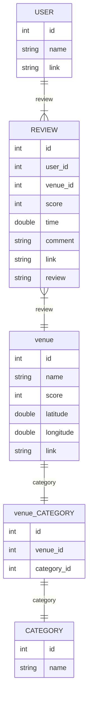

# Recommendation System

โปรเจคแนะนำอะไรสักอย่าง ด้วยเทคนิค Recommendation System ตอนนี้ก็พยายามดึงข้อมูลสถานที่มาจาก Google Map ด้วยเทคนิค Web Scraping และจะเก็บลงฐานข้อมูลเพื่อนำมาประมวลผลต่อไป

# Setup

## ติดตั้งแพ็กเก็จสำหรับ Python

ที่ Terminal เรียกใช้คำสั่ง pip install ตามด้วย package เพื่อทำการติดตั้ง

```
pip freeze >> requirements.txt
pip install -r requirements.txt
```

## ติดตั้ง Chrome Driver

สำหรับการดึงข้อมูลรีวิวสถานที่ที่มีใน Google Maps โดยใช้ chromedriver โดยเครืองต้องมีการติดตั้ง [Chrome Browser](https://www.google.com/intl/th_th/chrome/)

## ติดตั้งฐานข้อมูลโดยใช้ Docker

ทำการดาวโหลดและติดตั้ง Docker จาก[เว็บไซด์](https://www.docker.com/) หลังจากนั้นเข้าไปที่โฟลเดอร์ `rs-db` และเรียกใช้คำสั่งสำหรับสร้าง Docker

```
docker-compose up
```

โปรแกรมจะทำการสร้าง Docker container และ Docker image ขึ้นมาสำหรับฐานข้อมูล MySQL

# การทำงาน

1. ใส่ url ของสถานที่ที่ได้จาก Google map `data/placelist.csv` โดยสถานที่แต่ละที่ ต่อหนึ่งบรรทัด
2. สั่งทำงานไฟล์ `googleplace.py`

   ```
   python googleplace.py
   ```

   คำสั่งเพิ่มเติมสำหรับเรียกใช้งานโดยการเพิ่มอากิวเม้นต์ต่อท้ายชื่อไฟล์

   | argument         | details                                                          |
   | ---------------- | ---------------------------------------------------------------- |
   | `--empty-db`     | สำหรับสั่งให้ลบตารางทั้งหมดออกจากฐานข้อมูล แล้วทำการสร้างใหม่    |
   | `--force-update` | สำหรับสั่งให้ดึงข้อมูลจากเว็บแม้ว่าจะมีข้อมูลอยู่แล้วในฐานข้อมูล |

   ตัวอย่างการทำงาน

   ```
   python googleplace.py --empty-db --force-update
   ```

3. กรณีสั่งบันทึกข้อมูลเป็นไฟล์ csv ด้วยคำสั่ง `--csv` ข้อมูลที่รวบรวมได้จะถูกเก็บไว้ในโฟลเดอร์ `results` แยกเป็น 2 ส่วน
   1. ข้อมูลสถานที่จะถูกเก็บไว้ที่ `results/place.csv`
   2. ข้อมูลรีวิวจะถูกเก็บไว้ที่ `results/csv/PLACE_NAME.csv`

# Entity Relationship Diagrams

โครงสร้างข้อมูล Dataframe โดยนำมาจากข้อมูลที่ได้จาก Google map ในการคำนวน



_หน่วยของ time เป็นปี หากน้อยกว่า 1 ปี จะใช้จุดทศนิยม เช่น 1 เดือนใช้ 0.1 เป็นต้น แต่หากมีระยะเวลานานกว่า 10 เดือนขึ้นไปนับเป็น 1 ปี_

## ChromeDriver ERROR

กรณีเกิดปัญหาข้อผิดพลาดในการเริ่มการทำงาน แสดงข้อผิดพลาดกรณี chromedriver.exe ไม่ตรงกับเวอร์ชั่นของ Chrome ในเครื่องคอมพิวเตอร์ ให้ทำการดาวโหลด chromedriver.exe ตัวใหม่ได้ที่ [ChromeDriver](https://chromedriver.chromium.org/downloads) ทำการเลือกเวอร์ชั่นและระบบปฏิบัติการ

```
Exception has occurred: SessionNotCreatedException
Message: session not created: This version of ChromeDriver only supports Chrome version 104
Current browser version is 114.0.5735.134
```
